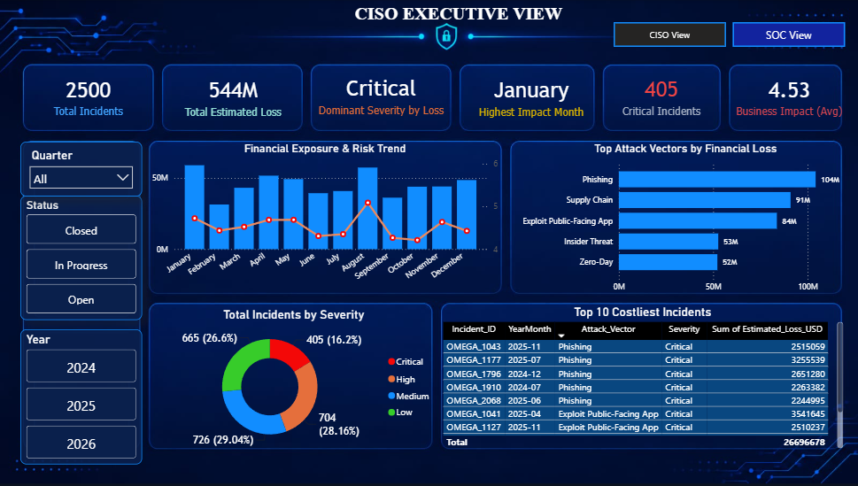
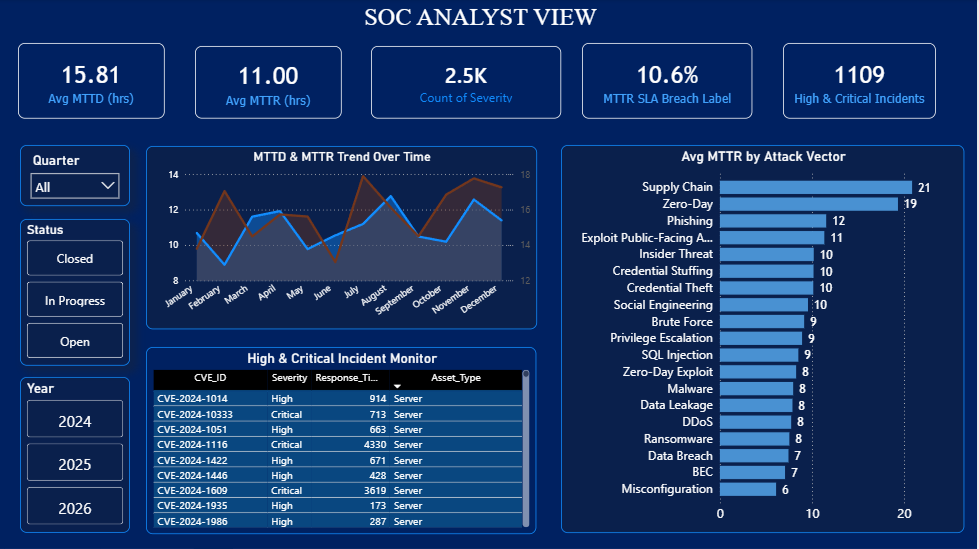
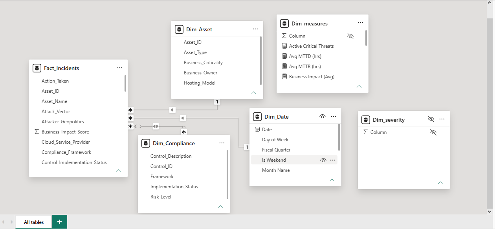

# 🔐 Cybersecurity Analysis Dashboard

<div align="center">


<br><br>

## 🛡️ Interactive Cybersecurity Data Analytics Dashboard

**Analyze • Visualize • Understand**

</div>

---

## 🛡️ Security Overview

<p align="center">
  
</p>

---

## 🚨 SOC View

<p align="center">
  
</p>

---

## 📊 Dashboard Analysis

<p align="center">
  
</p>

---

## 📌 Project Overview

The **Cybersecurity Analysis Dashboard** is an interactive **Microsoft Power BI project** developed to analyze cybersecurity incidents, attack patterns, network security, financial impact, and security risks.

The dashboard converts cybersecurity data into interactive visual insights using Power BI.

---

## 🎯 Project Objectives

- Analyze cybersecurity incidents
- Identify critical security incidents
- Analyze attack patterns
- Analyze network security
- Understand financial impact
- Identify security risks
- Monitor important cybersecurity KPIs
- Visualize cybersecurity trends

---

## 📊 Dashboard Pages

| Page | Description |
|---|---|
| 🛡️ **Security Overview** | Overall cybersecurity incidents and KPIs |
| 🚨 **Attack Analysis** | Attack types, severity, and incident patterns |
| 🌐 **Network Security Analysis** | Network-related attacks and security activity |
| 💰 **Financial Impact** | Estimated financial losses and business impact |
| ⚠️ **Security Risk** | Critical incidents and risk analysis |

---

## 📈 Key Performance Indicators

| KPI | Value |
|---|---:|
| 🚨 **Total Incidents** | **2,500** |
| 💰 **Estimated Loss** | **544M** |
| 🔴 **Critical Incidents** | **405** |
| 📅 **Highest Impact Month** | **January** |
| 📊 **Average Business Impact** | **4.53** |

---

## 🛠️ Tools & Technologies

- Microsoft Power BI
- Power Query
- Data Cleaning
- Data Transformation
- Data Analysis
- Data Visualization
- Cybersecurity Analytics
- Business Intelligence

---

## 📌 Power BI Features Used

- 📊 KPI Cards
- 📈 Line Charts
- 📊 Bar Charts
- 🍩 Donut Charts
- 🔵 Scatter Charts
- 🎛️ Slicers
- 🔍 Filters
- 📑 Page Navigation
- 🔗 Cross-Filtering
- 🧩 Data Modeling

---

## 🔄 Project Workflow

```text
Data Collection
       ↓
Data Cleaning
       ↓
Data Transformation
       ↓
Data Modeling
       ↓
Data Analysis
       ↓
Data Visualization
       ↓
Dashboard Development
       ↓
Cybersecurity Insights
